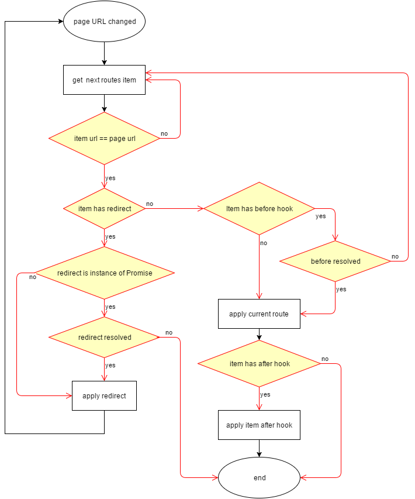

# vue-h-router
[](https://badge.fury.io/js/vue-h-router)
[](http://opensource.org/licenses/MIT)
[](https://travis-ci.org/zont/vue-h-router)

> Edge 12+, FF 36+, Chrome 49+, or use translation from ES2105 to ES5

## Introduction

`vue-h-router` is the small router for [Vue.js](http://vuejs.org). It deeply integrates with Vue.js core to make building Single Page Applications with Vue.js a breeze. Features include:

- Lightweight: 2kb of sources
- No dependencies
- Modular, component-based router configuration
- Route params
- Hash mode navigation
- HTML5 history support
- Route hooks

## Setup
```bash
npm install vue-h-router
```

## Example
```javascript
import Vue from 'vue';
import router from 'vue-h-router';


Vue.use(router);


const HomeView = {
  template: '<div>Home</div>'
};
const LoginView = {
  template: '<div>Login</div>'
};
const user = {
  authorized: true,
  logout() {
    return fetch('backend/logout');
  }
};
const checkAuth = () => {
  return user.authorized ? Promise.resolve() : Promise.reject();
};
const checkNotAuth = () => {
  return !user.authorized ? Promise.resolve() : Promise.reject();
};

router.init([
  {
    url: '/home',
    component: HomeView,
    before: checkAuth
  },
  {
    url: '/login',
    component: LoginView,
    before: checkNotAuth
  },
  {
    url: '/logout',
    redirect() {
      return user.logout()
         .then(() => {
           user.authorized = false;
           return '/login';
         });
    }
  },
  {
    url: '.*',
    redirect() {
       return Promise.resolve(user.authorized ? '/home' : '/login')
    }
  }
]);

const app = new Vue({
  template: `
    <div class="main">
      <component :is="$route.component"/>
    </div>
  `,
  el: '#app'
});
```

## API

### Router Instance

The router instance can be found in inside components as **this.$router**.

#### router.init(routes)
Adds a list of routes to router and immediately applies it to the current page url.
```javascript
import Vue from 'vue';
import router from 'vue-h-router';


Vue.use(router);

const Home = {
  template: '<div>Home content</div>'
};

router.init([
  {
    url: '/home',
    component: Home
  },
  {
    url: /.*/,
    redirect: '/home'
  }
]);
```

#### router.route
  - type: `Route`

The current route represented as a Route Object.  

### Routes list item fields

#### url
  - type: `String` or `RegExp`
  
If **url** is string, then it converts to RegExp:
```javascript
router.init([
  {
    url: '.*',  // converts to /^.*$/
    component: {}
  }
]);
```
You can match arguments from url by using parentheses:
```javascript
router.init([
  {
    url: /^\/department\/(it|cleaning)\/user\/(\d+)$/,
    component: {}
  }
]);

location.hash = '/department/it/user/21';

// router.route.args is ['it', '21'];
```

#### component
  - type: `Vue Component`
  
#### redirect
  - type: `String`

Applies immediately when route matched.
Current route is not saved in the history.
```javascript
location.hash = '/about';

router.init([
  {
    url: '/home',
    component: {}
  },
  {
    url: '/about',
    component: {}
  },
  {
    url: '.*',
    redirect: '/home'
  }
]);

// history is empty
// current url is /about

location.hash = '/not/existed/page';

// history like ['/about']
// current url is /home
```

#### redirect(newRoute)
  - return `Promise`

If promise resolved then redirect applies.
If promise rejected then current navigation was aborted. 

#### before(newRoute)
  - return `Promise`

If promise resolved then redirect applies.
If promise rejected then **router** tries to find next matching route.

#### after(oldRoute, newRoute)

Called after current route applies.

> Router searches for the route in the order in which they appear in the list.

  

### Route object

A route object represents the state of the current active route.
It contains parsed information of the current URL

The route object is immutable.
Every successful navigation will result in a fresh route object.

The route object can be found in multiple places:
  - Inside components as **this.$route**
  - Inside router as **router.route**
  - Inside redirect function:
    - **redirect(newRoute)**
  - Inside navigation hooks:
    - **before(newRoute)**
    - **after(oldRoute, newRoute)**

#### $route.url
  - type: `String`

The full resolved URL including query.

#### $route.args
  - type: `Array`

The list of dynamic segments values.

#### $route.component
  - type: `Vue Component`

The Vue component corresponding to the current route.
